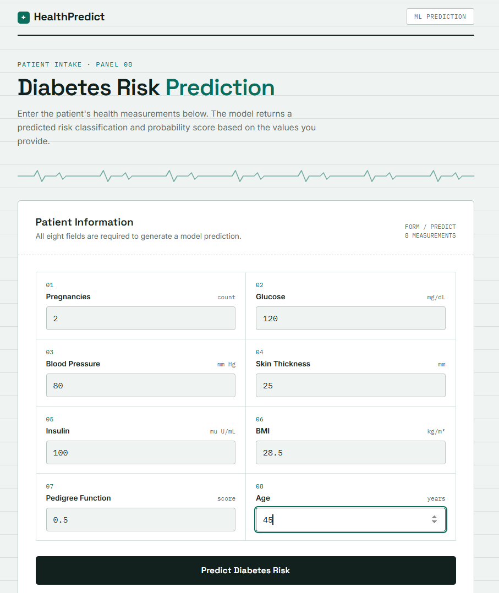
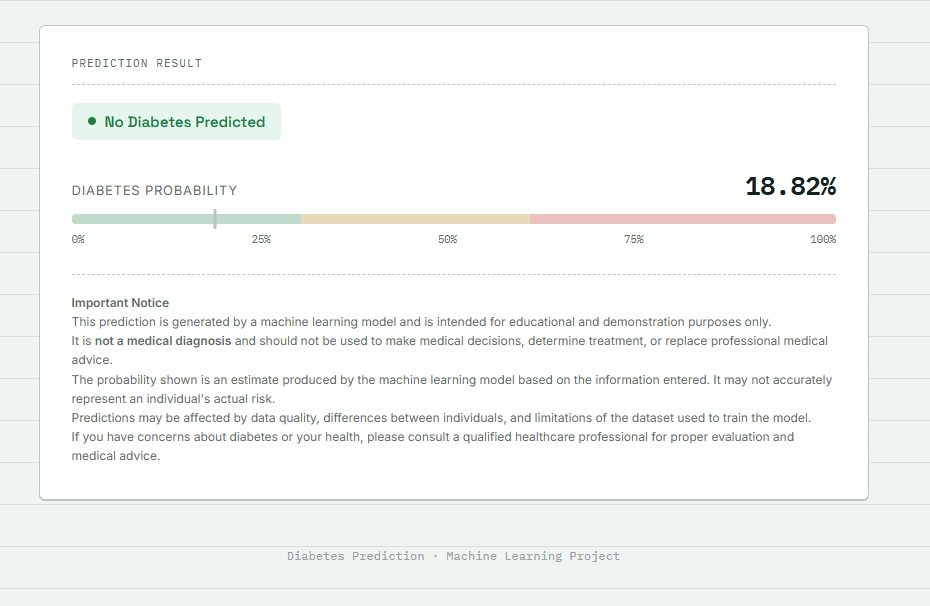

# 🩺 Diabetes Prediction ML Web Application

A machine learning classification project that predicts the likelihood of diabetes based on patient health and demographic measurements.

The project uses a **Support Vector Machine (SVM)** classifier with feature scaling and hyperparameter tuning using **GridSearchCV**. A Flask-based web application provides an interactive interface where users can enter patient measurements and receive a model-generated prediction and probability score.

> **⚠️ Important:** This project is created for educational and machine learning demonstration purposes only. It is **not a medical diagnostic system** and should not be used to make medical decisions or replace professional medical advice.

---

## 📌 Project Overview

Diabetes is a chronic condition that can be influenced by several health and demographic factors.

The objective of this project is to build an end-to-end machine learning pipeline capable of learning patterns from patient health measurements and predicting whether an input record is classified as having diabetes based on the provided measurements.

The project covers the complete machine learning workflow:

* Data loading and preprocessing
* Exploratory data analysis
* Feature and target separation
* Train-test splitting
* Feature scaling
* Support Vector Machine classification
* Hyperparameter tuning using GridSearchCV
* Model evaluation
* Probability estimation
* Model serialization using Pickle
* Flask web application development
* User input handling
* Prediction visualization

---

## 🎯 Project Objectives

The main objectives of this project are:

1. Analyze a diabetes dataset containing patient health measurements.
2. Prepare the data for machine learning.
3. Train a classification model to predict diabetes.
4. Use feature scaling to improve model performance.
5. Tune SVM hyperparameters using cross-validation.
6. Evaluate the trained model using multiple classification metrics.
7. Save the trained model for later predictions.
8. Build a simple web interface using Flask.
9. Allow users to enter patient measurements and obtain a model prediction.
10. Demonstrate an end-to-end machine learning application.

---

## 📊 Dataset

The model is trained using a diabetes dataset containing medical and demographic measurements.

### Features

| Feature                    | Description                      |
| -------------------------- | -------------------------------- |
| `Pregnancies`              | Number of pregnancies            |
| `Glucose`                  | Plasma glucose concentration     |
| `BloodPressure`            | Diastolic blood pressure         |
| `SkinThickness`            | Triceps skin fold thickness      |
| `Insulin`                  | Insulin level                    |
| `BMI`                      | Body Mass Index                  |
| `DiabetesPedigreeFunction` | Diabetes pedigree function value |
| `Age`                      | Age of the patient               |

### Target

| Target    | Description                       |
| --------- | --------------------------------- |
| `Outcome` | `0` = No diabetes, `1` = Diabetes |

The target variable is separated from the input features before training.

---

## 🧠 Machine Learning Approach

The project uses a **Support Vector Machine (SVM)** classifier.

The overall pipeline is:

```text
Dataset
   ↓
Data Loading
   ↓
Feature / Target Separation
   ↓
Train-Test Split
   ↓
StandardScaler
   ↓
SVM Classifier
   ↓
GridSearchCV
   ↓
Best Model
   ↓
Evaluation
   ↓
Saved Model
   ↓
Prediction
   ↓
Flask Web Application
```

---

## 🔧 Data Preprocessing

The dataset is loaded using Pandas.

The target column, `Outcome`, is separated from the input features.

```python
X = df.drop("Outcome", axis=1)
y = df["Outcome"]
```

The dataset is then divided into training and testing sets.

```python
X_train, X_test, y_train, y_test = train_test_split(
    X,
    y,
    test_size=0.2,
    random_state=42,
    stratify=y
)
```

### Why `stratify=y`?

The target contains two classes:

* `0` → No diabetes
* `1` → Diabetes

Using `stratify=y` helps maintain a similar class distribution in both the training and testing datasets.

---

## 📏 Feature Scaling

The project uses `StandardScaler` before training the SVM model.

```python
StandardScaler()
```

This transforms the features so that they have a standardized scale.

Feature scaling is particularly important for SVM because the algorithm is sensitive to the relative scale of input features.

The scaling and classification steps are combined into a Scikit-learn pipeline:

```python
pipeline = Pipeline([
    ("scaler", StandardScaler()),
    ("model", SVC(probability=True))
])
```

Using a pipeline also helps ensure that preprocessing is consistently applied during training and prediction.

---

## 🤖 Support Vector Machine

The primary machine learning algorithm used in this project is **Support Vector Machine (SVM)**.

SVM attempts to find a decision boundary that separates different classes while maximizing the margin between them.

In this project, the SVM is configured with:

```python
SVC(probability=True)
```

The `probability=True` option enables probability estimates that are used by the application to display the model's estimated probability for the positive class.

---

## 🔍 Hyperparameter Tuning

Instead of manually selecting SVM parameters, the project uses **GridSearchCV** to evaluate multiple parameter combinations.

The search space is:

```python
param_grid = {
    "model__C": [0.1, 1, 10, 100],
    "model__kernel": ["linear", "rbf"],
    "model__gamma": ["scale", "auto"]
}
```

The parameters explored include:

### `C`

Controls the trade-off between:

* Maximizing the margin
* Correctly classifying training examples

### `kernel`

The project tests:

* `linear`
* `rbf`

### `gamma`

The project tests:

* `scale`
* `auto`

GridSearchCV uses 5-fold cross-validation:

```python
GridSearchCV(
    pipeline,
    param_grid,
    cv=5,
    scoring="f1"
)
```

The F1 score is used as the optimization metric because it balances precision and recall.

---

## 🏆 Best Model Configuration

The best-performing configuration obtained during tuning was:

```text
C = 1
kernel = linear
gamma = scale
```

The best cross-validation F1 score obtained during model tuning was approximately:

```text
0.6387
```

These values represent the results obtained during the current training configuration and may change if the dataset, preprocessing, random seed, or hyperparameter search space is changed.

---

## 📈 Model Evaluation

The model is evaluated on the held-out test set.

The project evaluates multiple metrics instead of relying only on accuracy.

### Metrics used

* Accuracy
* Confusion Matrix
* Precision
* Recall
* F1 Score
* ROC-AUC
* ROC Curve

### Accuracy

Measures the overall percentage of correctly classified observations.

### Precision

Measures how many of the patients predicted as positive actually belong to the positive class.

### Recall

Measures how many of the actual positive cases were correctly identified.

### F1 Score

The F1 score provides a balance between precision and recall.

### ROC-AUC

ROC-AUC measures how well the model distinguishes between the two classes across different classification thresholds.

The current model achieved an ROC-AUC of approximately:

```text
0.8278
```

> These metrics should be interpreted as machine learning evaluation results rather than clinical performance indicators.

---

## 📊 ROC Curve

The evaluation script generates a ROC curve using the model's predicted probabilities.

The ROC curve compares:

* True Positive Rate
* False Positive Rate

This provides another way to evaluate the model's ability to distinguish between the two classes.

---

## 💾 Model Serialization

After training and hyperparameter tuning, the best estimator is saved using Python's `pickle` module.

The saved model is located at:

```text
models/diabetes_model.pkl
```

The saved object contains the complete Scikit-learn pipeline, including:

```text
StandardScaler
     +
SVM classifier
```

This allows the same preprocessing and model configuration to be reused when making predictions.

---

## 🔮 Prediction System

The project includes a standalone prediction script:

```text
src/predict.py
```

The script loads the saved model and asks the user to enter the required input values.

The eight inputs are:

```text
Pregnancies
Glucose
Blood Pressure
Skin Thickness
Insulin
BMI
Diabetes Pedigree Function
Age
```

The entered values are passed to the trained pipeline.

The model then produces:

1. A predicted class
2. An estimated probability for the positive class

Example output format:

```text

<Predicted class>

Diabetes probability: XX.XX%

```

The probability displayed by the application is a **model-generated probability estimate**, not a medically validated risk percentage.

---

# 🌐 Flask Web Application

The project also includes a Flask-based web interface.

The application allows users to enter the eight required measurements through a browser instead of using the command line.

### Application flow

```text
User
 ↓
Enters patient measurements
 ↓
Flask receives form data
 ↓
Input is converted into numerical values
 ↓
Saved ML pipeline processes the input
 ↓
SVM generates prediction
 ↓
Probability is calculated
 ↓
Result is displayed in the browser
```

---

## 🖥️ Application Preview

### Input Interface

The application provides a form where the user can enter all required patient measurements.



### Prediction Result

After submitting the values, the application displays the model's prediction and estimated probability.



---

## 📁 Project Structure

```text
diabetes-prediction-ml/
│
├── README.md
├── requirements.txt
├── .gitignore
├── LICENSE
│
├── data/
│   └── diabetes.csv
│
├── models/
│   └── diabetes_model.pkl
│
├── src/
│   ├── preprocessing.py
│   ├── train.py
│   ├── evaluate.py
│   └── predict.py
│
├── app/
│   ├── app.py
│   ├── templates/
│   │   └── index.html
│   └── static/
│       └── static.css
│
└── screenshots/
    ├── Input_values.png
    └── Output_prediction.png
```

---

## 📂 File and Directory Explanation

### `data/`

Contains the dataset used for training and evaluation.

```text
data/diabetes.csv
```

### `models/`

Contains the trained machine learning model.

```text
models/diabetes_model.pkl
```

### `src/preprocessing.py`

Responsible for:

* Loading the dataset
* Separating features and target

### `src/train.py`

Responsible for:

* Loading the data
* Splitting the dataset
* Creating the ML pipeline
* Performing GridSearchCV
* Finding the best SVM configuration
* Training the model
* Saving the trained model

### `src/evaluate.py`

Responsible for:

* Loading the saved model
* Evaluating predictions
* Generating classification metrics
* Calculating ROC-AUC
* Generating the ROC curve

### `src/predict.py`

Provides a command-line prediction interface.

It:

* Loads the trained model
* Accepts user input
* Generates a prediction
* Displays the estimated probability

### `app/app.py`

Runs the Flask web application and connects the user interface to the trained machine learning model.

### `app/templates/index.html`

Contains the HTML structure of the web interface.

### `app/static/static.css`

Contains the styling for the web application.

### `screenshots/`

Contains screenshots demonstrating the application interface and prediction output.

### `requirements.txt`

Contains the Python dependencies required to run the project.

---

# ⚙️ Installation

## 1. Clone the Repository

```bash
git clone https://github.com/aayushmudgal18/diabetes-prediction-ml.git
```

Move into the project directory:

```bash
cd diabetes-prediction-ml
```

---

## 2. Create a Virtual Environment

It is recommended to use a virtual environment.

### Windows

```bash
python -m venv venv
```

Activate it:

```bash
venv\Scripts\activate
```

### macOS / Linux

```bash
python3 -m venv venv
```

Activate it:

```bash
source venv/bin/activate
```

---

## 3. Install Dependencies

Install the required Python packages:

```bash
pip install -r requirements.txt
```

The project primarily uses:

* Python
* Pandas
* Scikit-learn
* Matplotlib
* Flask

---

# ▶️ Running the Project

## Train the Model

From the project root directory:

```bash
python src/train.py
```

The script performs hyperparameter tuning and saves the best trained model to:

```text
models/diabetes_model.pkl
```

---

## Evaluate the Model

Run:

```bash
python src/evaluate.py
```

This displays:

* Accuracy
* Confusion Matrix
* Classification Report
* ROC-AUC

It also generates the ROC curve.

---

## Make a Command-Line Prediction

Run:

```bash
python src/predict.py
```

The program will ask for the required patient measurements.

Example:

```text
Pregnancies: 2
Glucose: 120
Blood Pressure: 80
Skin Thickness: 25
Insulin: 100
BMI: 28.5
Diabetes Pedigree Function: 0.5
Age: 45
```

The model will then generate a prediction and probability estimate.

---

# 🌐 Running the Flask Application

Navigate to the application directory:

```bash
cd app
```

Run:

```bash
python app.py
```

Flask will start the local development server.

Open the local address displayed in the terminal in a web browser.

The web interface allows the user to:

1. Enter patient measurements.
2. Submit the form.
3. Send the values to the Flask backend.
4. Load the trained machine learning pipeline.
5. Generate a prediction.
6. Display the prediction and estimated probability.

---

# 🧪 Example Prediction

The following example demonstrates a prediction generated by the application.

### Input Values

| Feature                    | Value |
| -------------------------- | ----: |
| Pregnancies                |     2 |
| Glucose                    |   120 |
| Blood Pressure             |    80 |
| Skin Thickness             |    25 |
| Insulin                    |   100 |
| BMI                        |  28.5 |
| Diabetes Pedigree Function |   0.5 |
| Age                        |    45 |

### Model Output

```text
No diabetes predicted

Diabetes probability: 18.82%
```

### Prediction Workflow

```text
Input Values
     ↓
Flask Web Application
     ↓
Saved Machine Learning Pipeline
     ↓
StandardScaler
     ↓
SVM Classifier
     ↓
Prediction + Probability
     ↓
No diabetes predicted
18.82% probability
```

> **Note:** The `18.82%` value is the probability estimate generated by the trained machine learning model. It is not a clinically validated measure of an individual's actual medical risk.

---

# 🔐 Safety and Medical Disclaimer

This application is a **machine learning demonstration project**.

It must not be considered a medical diagnostic tool.

The prediction:

* Is generated by a machine learning model.
* Is based only on the information provided to the model.
* May be affected by the limitations of the training dataset.
* May not generalize to every individual.
* Does not account for a complete medical history.
* Should not be used to determine treatment or medication.
* Should not replace professional medical evaluation.

The probability displayed by the application is a **model probability estimate** and should not be interpreted as a clinically validated probability of developing or having diabetes.

Anyone with health concerns should consult a qualified healthcare professional.

---

# ⚠️ Limitations

Although the project demonstrates a complete machine learning workflow, it has several limitations.

### 1. Dataset Limitations

The model's performance depends heavily on the quality, size, and representativeness of the dataset used for training.

### 2. Limited Features

Only eight input features are used.

Real-world diabetes risk assessment can involve many additional factors, such as:

* Family history
* Diet
* Physical activity
* Medical history
* Medication
* Other laboratory measurements

### 3. Dataset Generalization

A model trained on one dataset may not perform equally well on different populations or clinical environments.

### 4. Probability Calibration

The probability generated by `SVC(probability=True)` is a model estimate and has not been clinically calibrated.

### 5. No Clinical Validation

The model has not been validated by medical professionals or tested in a real clinical environment.

### 6. Educational Purpose

The application is intended to demonstrate machine learning concepts and software integration rather than provide medical advice.

---

# 🚀 Future Improvements

Several improvements could make the project more robust.

### Machine Learning Improvements

* Perform more extensive feature engineering.
* Handle missing or invalid values more systematically.
* Investigate class imbalance.
* Compare additional classification algorithms.
* Perform probability calibration.
* Use stratified cross-validation throughout model comparison.
* Perform external validation using another dataset.
* Experiment with ensemble methods.
* Perform systematic error analysis.

### Application Improvements

* Add stronger input validation.
* Prevent unrealistic numerical values.
* Add informative validation messages.
* Improve accessibility.
* Add responsive mobile styling.
* Add model performance information to the UI.
* Add an API endpoint for predictions.
* Deploy the application to a cloud platform.

### MLOps Improvements

* Add automated testing.
* Add CI/CD using GitHub Actions.
* Version datasets and models.
* Track experiments.
* Add structured logging.
* Containerize the application using Docker.

---

# 🛠️ Technologies Used

| Technology     | Purpose                             |
| -------------- | ----------------------------------- |
| Python         | Core programming language           |
| Pandas         | Data loading and manipulation       |
| Scikit-learn   | Machine learning and evaluation     |
| SVM            | Classification algorithm            |
| StandardScaler | Feature scaling                     |
| GridSearchCV   | Hyperparameter optimization         |
| Matplotlib     | Data/model visualization            |
| Flask          | Web application backend             |
| HTML           | Web interface                       |
| CSS            | UI styling                          |
| Pickle         | Model serialization                 |
| Git & GitHub   | Version control and project hosting |

---

# 📚 Key Machine Learning Concepts Demonstrated

This project demonstrates practical understanding of:

* Supervised learning
* Binary classification
* Train-test splitting
* Stratified sampling
* Feature scaling
* Machine learning pipelines
* Support Vector Machines
* Hyperparameter tuning
* Cross-validation
* Precision
* Recall
* F1 Score
* Confusion Matrix
* ROC-AUC
* ROC Curves
* Probability prediction
* Model serialization
* Model inference
* Flask integration

---

# 💡 What I Learned

Through this project, I gained practical experience in taking a machine learning problem from raw data to a usable application.

The project helped me understand:

* How to prepare real-world datasets for machine learning.
* Why feature scaling matters for algorithms such as SVM.
* How to use Scikit-learn pipelines.
* How hyperparameter tuning can improve model selection.
* How cross-validation helps evaluate models more reliably.
* Why accuracy alone is not enough for classification problems.
* How to save and reload trained ML models.
* How to connect a trained ML model with a Flask application.
* How to structure a machine learning project into separate modules.
* How to build a complete ML project suitable for deployment and portfolio presentation.

---

# 🔄 End-to-End Architecture

```text
                    ┌──────────────────┐
                    │  diabetes.csv    │
                    └────────┬─────────┘
                             │
                             ▼
                  ┌─────────────────────┐
                  │   Preprocessing     │
                  │   preprocessing.py  │
                  └──────────┬──────────┘
                             │
                             ▼
                  ┌─────────────────────┐
                  │ Train/Test Split    │
                  │     80% / 20%       │
                  └──────────┬──────────┘
                             │
                             ▼
                  ┌─────────────────────┐
                  │   StandardScaler    │
                  └──────────┬──────────┘
                             │
                             ▼
                  ┌─────────────────────┐
                  │        SVM          │
                  └──────────┬──────────┘
                             │
                             ▼
                  ┌─────────────────────┐
                  │    GridSearchCV     │
                  │     5-Fold CV       │
                  └──────────┬──────────┘
                             │
                             ▼
                  ┌─────────────────────┐
                  │   Best Estimator    │
                  └──────────┬──────────┘
                             │
                             ▼
                ┌────────────────────────┐
                │ diabetes_model.pkl     │
                └────────────┬───────────┘
                             │
                  ┌──────────┴──────────┐
                  │                     │
                  ▼                     ▼
          ┌───────────────┐    ┌────────────────┐
          │ predict.py    │    │ Flask Web App  │
          │ CLI Prediction│    │    app.py      │
          └───────┬───────┘    └───────┬────────┘
                  │                     │
                  └──────────┬──────────┘
                             ▼
                    Prediction + Probability
```

---

# 📌 Project Status

**Status: Completed ✅**

The current version includes:

* ✅ Data preprocessing
* ✅ Train/test splitting
* ✅ Feature scaling
* ✅ SVM classification
* ✅ Hyperparameter tuning
* ✅ Cross-validation
* ✅ Model evaluation
* ✅ ROC-AUC evaluation
* ✅ Model serialization
* ✅ Command-line prediction
* ✅ Flask web application
* ✅ User input interface
* ✅ Prediction output
* ✅ Medical disclaimer
* ✅ Project documentation

---

# 👨‍💻 Author

**Aayush Mudgal**

BTech Computer Science Engineering

Interested in:

* Machine Learning
* Artificial Intelligence
* Data Science
* Python
* ML Engineering

---

# 📄 License

This project is licensed under the **MIT License**.

See the [`LICENSE`](LICENSE) file for more information.

---


